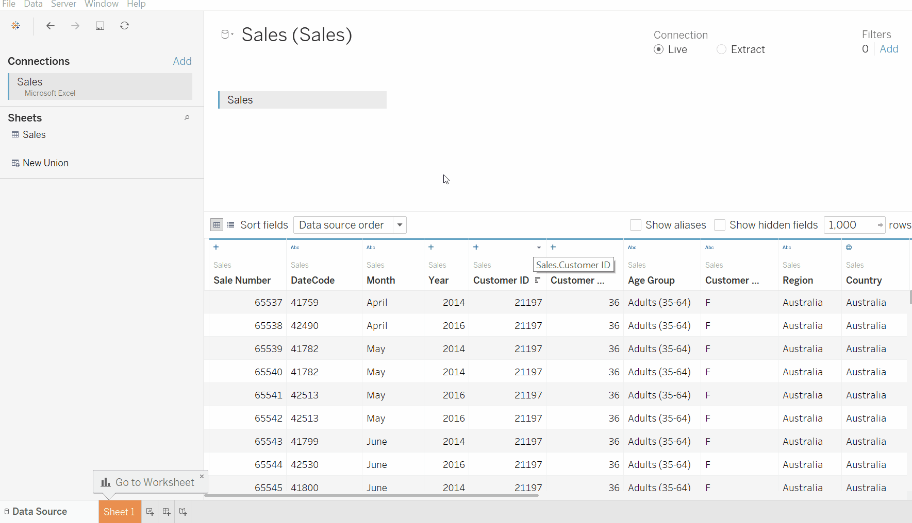
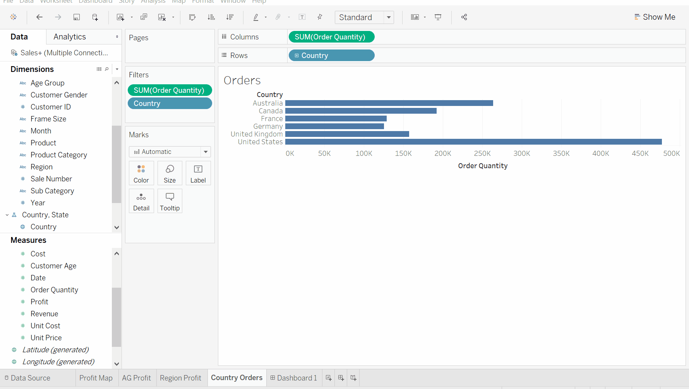
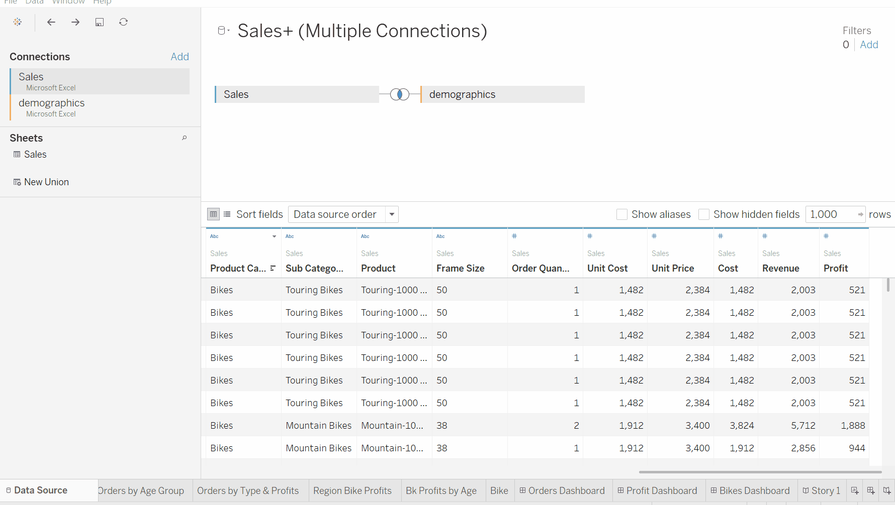

![DSL Logo][dsllogo]

# Tableau Tutorial Project
##### By Thomas Lillo

### Details

This project provides students with 24/7 access to the Introduction to Tableau Workshop run by the Digital Scholarship Lab at Brock University. The introduction to Tableau workshop was created for in person delivery, but has also be converted into a youtube video to ensure that students can follow along anywhere, anytime. The video will be available on youtube and through the DSL website.

### The Tutorial

The Full Video Tutorial is Available on YouTube Here: https://youtu.be/Qfmmj4Zqc5E

## Here are some highlights of what you'll learn!

#### The types of data that can be used in Tableau!

#### How to quickly create tons of useful visualizations!

#### How to build effective and interactive visuals!

#### Creating new information from existing data through calculated fields!

#### How to create interactive dashboards!

#### Building effective narratives with storyboards!

<!--- Please use reference style images so that it is easier to update pictures later --->

[dsllogo]: dsl_logo.png
[tablogo]: Tableau-logo.jpg
